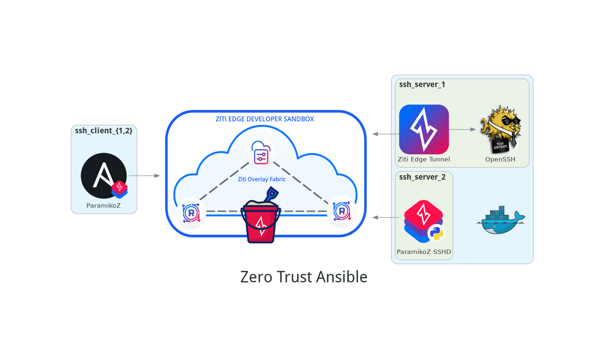

# Zero Trust Ansible Demo

But...why?

> *Seeing is believing, but feeling is the truth.* -Thomas Fuller

Isn't SSH secure enough?

Ansible is widely deployed and likely used within your organization. Most deployments (not yours, of course) are insecure. More often than not, we defend our precious SSHD servers by limiting their use to the walled garden of the firewall, where the server can listen on its port happily if not naively. Sadly, sometimes we see this scenario when the host is publicly exposed, often relying completely on a single layer of security e.g. a password or key pair. To make matters worse, many deployments leverage a service user with shared credentials per environment. Sometimes, they invoke Ansible from a centralized server, and sometimes that user has password-less sudo. What could possibly go wrong?

 High-performing organizations can go farther by requiring administrators to act in the context of their organizational user with credentials that hold the least necessary privilege for each task. Even that level of diligence is limited to the trust domain of the network. Managing things at the logical edge poses additional ongoing challenges. For example, SSH is not always a viable candidate for managing distributed and vendored services because the necessary network infrastructure may not be within the purview of the SSH server administrator.

How can we do even better?

Enter ParamikoZ, Python SSH with built-in OpenZiti!

> *If we cannot pass over the mountain, let us go under it* -Gimli, son of Gloin

## The Bird's Eye View



What is this, you ask?

1. An Ansible client
2. A pair of Ziti Edge Developer Sandbox (ZEDS) apps
3. A docker-compose stack of a pair of SSH servers, one for each of the aforementioned apps

Now let's gather some supplies for this brief journey...

### Requirements

1. Python
2. OpenZiti Python SDK
3. Docker Engine (or Podman Socket)
    * Player's choice on rootful vs rootless, both work
4. docker-compose (or podman-compose integration)
5. Ansible CLI

There is a `requirements.txt` file at the root of the project. It will install `ansible` and the `openziti` PyPI modules.

```bash
# You can use virtualenv or venv, player's choice
pip install --user -r requirements.txt
```

**Whoah, whoah there buddy...that's a lot stuff. "Zero Trust" you say, well why don't we talk about what are we doing here for a second?**

## Our Objective

Before going any further, be aware this explainer is accompanied by a `setup.sh` script and video that will step through the procedure. Still, it's important to get some footing before jumping off the deep end.

We are going to deploy some non-privileged SSH servers locally, sandboxed away in containers. One of them, will be behind our `ziti-edge-tunnel` software container in a shared network. This tunneller will act as an agent for the vanilla OpenSSH sshd. In the other container is a custom, Paramiko-based ssh server that has been "Zitified" with our brand new `python-sdk-py` (PyPi `openziti`). Importantly, these SSH server containers **don't listen on any public interface, don't have any special Linux Capabilities (permissions), and have NO ports mapped to them**. 

The only way to reach the SSH servers is via the OpenZiti App Network we'll create.

For that, we're going to use the Ziti Edge Developer Sandbox (ZEDS). It allows us to set up OpenZiti networks for development purposes like this demo, but without having to worry about all the underlying OpenZiti components (like the `ziti-controller`, `ziti-router`, service policies, etc.). Don't worry, we'll show you how and give you everything you need below via a short video and some configs you can copy and paste.

Finally, we want to do some work with Ansible. That's where our ParamikoZ connection plugin comes in which happens to be less than 60 LOC, is fully integrated with Ansible's configuration hooks, and allows you to connect with an OpenZiti Identity to your Compose services, the SSH servers. This connection plugin supercharges Ansible by conferring the power to find an OpenZiti Service by matching the inventory hostname to a configured service address. Lastly, we have some eastereggs.

## Into the Wild

Let's get familiar with ZEDS.

The video below steps through the UI to show you how this is done. **It is important that you follow the naming conventions shown in the video verbatim, as we will rely on them in the `setup.sh` script**

We're going to create two ZEDS "apps". You can think of "apps" as independent OpenZiti Networks. ZEDS does the heavy lifting for you by hosting the OpenZiti Network and global fabric.

For each of these apps, we will provision a client identity and a server identity. You'll download a one-time JWT enrollment token for each identity. The client identity will be used for the Ansible paramikoz plugin, and the server identity will be used for the OpenZiti component of the ssh server running in the container.

Next we will create a service definition for each app. These service definitions provide the Ansible inventory hostnames via a config type called `intercept.v1`. This will provide the hostname resolution mechanism for the ParamikoZ connection plugin for Ansible.

The `ssh-service-zet` (<code>**z**iti-**e**dge-**t**unnel</code>) will also have a `host.v1` configuration, which the tunnel will use to off-board data from the overlay network. The `ssh-service-sdk` does not need this because the overlay delivers your SSH connection **directly** into the ParamikoZ SSH server application. No agent needed!

As you step through the video, feel free to use the copy bottons below on the JSON configs to save you from typing, and to ensure a consistent experience.

[video]

### `ssh-service-zet`

intercept.v1

```json
{
  "addresses": [
    "ansibletarget1.ziti"
  ],
  "protocols": [
    "tcp"
  ],
  "portRanges": [
    {
      "low": 22,
      "high": 22
    }
  ]
}
```

host.v1

```json
{
  "port": 22,
  "address": "openssh-server",
  "protocol": "tcp"
}
```

### `ssh-service-sdk`

intercept.v1

```json
{
  "addresses": [
    "ansibletarget2.ziti"
  ],
  "protocols": [
    "tcp"
  ],
  "portRanges": [
    {
      "low": 22,
      "high": 22
    }
  ]
}
```

## Showtime

If you've followed the steps in the videos you now have 4 one-time JWT enrollment tokens downloaded.

1. `ssh_client_1.jwt`
2. `ssh_client_2.jwt`
3. `ssh_server_1.jwt`
4. `ssh_server_2.jwt`

You should also have copied the fully qualified service name of the `ssh-service-sdk` service into your clipboard by clicking the clipboard button in the service editor screen.

Before running the `setup.sh`, please follow these steps:

```bash
# Copy your newly minted JWT tokens into the expected location
cp ~/Downloads/ssh_{client,server}_?.jwt secrets/tokens/
```

```bash
# Export your SDK app service name by pasting from your clipboard the value from the service editor screen (click the clipboard button to copy)
export ZITI_SDK_SERVICE="[my_app_name] ssh-service-sdk [my_base64_string]"
```

```bash
# Run setup.sh script to:
# 1) Generate needed secrets
# 2) Enroll JWT tokens
# 3) Build service containers
# 4) Start the docker-compose stack
./setup.sh
```

### The Payoff

You've made it here. Congratulations! Welcome to Zero Trust Ansible. Step forward and claim your prize.

```bash
# List your inventory hosts
ansible "all" --list

# Let's see if we can reach our hosts 
# over the OpenZiti overlay
# provided by ZEDS
ansible "all" -m ping
```

**This should look indestinguishable from any other ansible run**. So, what's going on here?

```bash
ansible "all" --extra-vars 'ziti_log_level=3' -m ping
```

You should now see a bunch of debug information written to stdout by the `ziti-python-sdk`.

Let's try something more taxing. Does this work for you?

```bash
ansible "all" -m setup
```

So, what's going on here?

### The Prestige

Each time a connection is made to the defined `intercept.v1` addresses, the `ParamikoZ` connection plugin rewrites the request at runtime, and sends it on it's way to the OpenZiti Network overlay. You are accessing your remote SSH servers **over** OpenZiti. Remember, there are *no ports* open on the containers as they are sandboxed away and you can't reach them yourself over your local network.

 The OpenZiti components in those containers are establishing duplexed connections outbound to the OpenZiti Network.  

If you provide your own server using one of our SDKs, you can also do some more fun things:

```bash
# Let's prove one of these is not like the other ;)
# ansibletarget1.ziti should fail
# ansibletarget2.ziti should give you a friendly welcome
ansible "all" -m raw -a "ziggywave"
```

### The End

All good things do come to an end. When you're ready, just run:

```bash
# Clean up containers
docker-compose down
```
